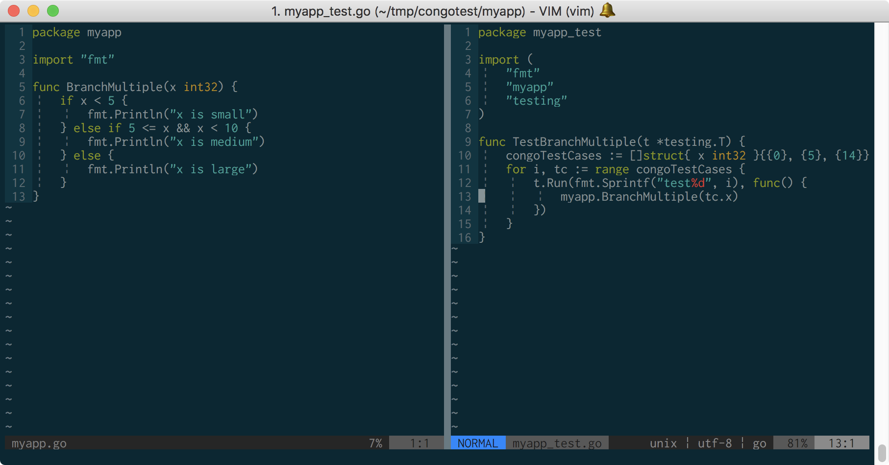

# Congo



Congo is a test generation framework for [Go](https://golang.org/).
It adopts [concolic testing](https://en.wikipedia.org/wiki/Concolic_testing) to generate test cases that will
achieve better test coverage than randomly generated ones.

Congo is still under development and not stable or sufficient for practical use now.

## Dependencies

Congo requires [Z3](https://github.com/Z3Prover/z3) to solve symbolic constraints.
The latest version is recommended.

Congo assumes that `z3.h` exists in the default include path and `libz3` exists in the default library path.
If you placed Z3 headers or libraries in a custom directory,
you may have to set `CGO_CFLAGS` or `CGO_LDFLAGS` to specify the correct path to them.
Please refer to the [cgo documentation](https://golang.org/cmd/cgo/) for more information.

## Install

```sh
$ go get -u github.com/ajalab/congo/...
```

## Usage

```
$ congo -f <function name> [-o <output file name>] <package>
```

You can specify the package by package path (e.g., `github.com/ajalab/congo`) or file name (e.g., `foo.go`), but the second pattern is available when `GO111MODULE=on`.

If `-o` option is not specified, Congo will output the generated test code to stdout.
However, you may not use redirection to generate test files like `congo -f Foo foo.go > foo_test.go`,
because it first creates empty `foo_test.go`, which will prevent the go compiler from building your package.

Currently Congo generates a separate package (`*_test`) for a target package.
This means you cannot specify unexported functions (starting with a lower letter).

## Features

The following types and operations are currently supported.

- booleans and logical operators
- integers (`int`, `uint`, `int8`, ...) and basic arithmetic operators. Congo treats an integer as a bit-vector.
- strings (only concatenation, checking equality, and computing length)
- pointers of above types. Congo supports pointer dereference and store. Congo detects panic caused by nil pointer dereference.
- function calls within the target package.

## Unsupported Features

Though Congo is being enthusiastically developed,
lots of features that you will need are not supported yet.

- struct
- floating points
- arrays and slices
- maps
- channels
- goroutines
- ...

## Internals

See [INTERNALS.md](INTERNALS.md) for details on how Congo works.

## License

Congo is licensed under the [MIT License](LICENSE).